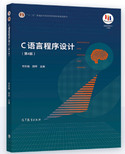
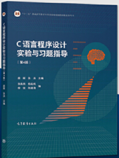

## 参考教材

|            教材             |                            图片                             |    作者     |
| :-------------------------: | :---------------------------------------------------------: | :---------: |
|   C语言程序设计（第4版）    |  | 何钦铭 颜晖 |
| C语言程序设计实验与习题指导 |  |  颜晖 张泳  |

------

## 文件说明

- <a href="Debug">Debug</a>：存放实验教材上所需的调试程序

- <a href="Lab">Lab</a>：存放实验教材《C语言程序设计实验与习题指导》课程实验，已在PTA平台上测试通过

- <a href="Primary">Primary</a>：存放主教材《C语言程序设计（第4版）》课后习题，已在PTA平台上测试通过

- <a href="Source">Source</a>：存放《C语言程序设计》（第4版）教材源码

- <a href="Supplement">Supplement</a>：存放PPT、**教师用书**和其他杂项(如教学方案和PTA题目集等)

------

## 关键程序

- 第三章：<a href="Source/ch03/3_07.c">统计字符-1</a>、<a href="Source/ch03/3_10.c">统计字符-2</a>

- 第四章：<a href="Source/ch04/4_01.c">估算PI值</a>、<a href="Source/ch04/4_03.c">统计整数位数</a>、<a href="Source/ch04/4_04.c">逆序输出整数</a>、<a href="Source/ch04/4_05_3.c">素数判断</a>、<a href="Source/ch04/4_09.c">斐波那契数列</a>、<a href="Source/ch04/4_11_2.c">搬砖问题</a>、<a href="Source/ch04/4_12.c">找零问题</a>

- 第五章：<a href="Source/ch05/5_02.c">五边形面积</a>、<a href="Source/ch05/5_03.c">判断完全平方数</a>、<a href="Source/ch05/5_04.c">最小公倍数</a>、<a href="Source/ch05/5_06.c">数字金字塔</a>、<a href="Source/ch05/5_07.c">复数运算</a>、<a href="Source/ch05/5_09.c">静态变量</a>

- 第六章：<a href="Source/ch06/6_01.c">大小写字母转换</a>、<a href="Source/ch06/6_05.c">统计单词个数</a>

- 第七章：<a href="Source/ch07/7_02.c">数组计算斐波那契数列</a>、<a href="Source/ch07/7_05.c">选择排序</a>、<a href="Source/ch07/7_07_2.c">二分查找</a>、<a href="Source/ch07/7_09.c">求矩阵最值</a>、<a href="Source/ch07/7_09.c">转置矩阵</a>、<a href="Source/ch07/7_10.c">计算日期</a>、<a href="Source/ch07/7_11.c">判断回文</a>、<a href="Source/ch07/7_12.c">凯撒密码</a>、<a href="Source/ch07/7_13.c">字符过滤</a>、<a href="Source/ch07/7_14.c">16进制->10进制</a>

- 第八章：<a href="Source/ch08/8_04.c">日期计算</a>、<a href="Source/ch08/8_05.c">冒泡排序</a>、<a href="Source/ch08/8_08.c">字符串压缩</a>、<a href="Source/ch08/8_10.c">动态内存分配</a>

- 第九章：<a href="Source/ch09/9_02.c">学生成绩排序</a>

- 第十章：<a href="Source/ch10/10_01.c">有序表的增删查操作</a>、<a href="Source/ch10/10_03.c">递归法求最大公约数</a>、<a href="Source/ch10/10_04_3.c">递归实现整数逆序输出</a>、<a href="Source/ch10/10_05.c">汉诺塔</a>、<a href="Source/ch10/10_06.c">金块问题</a>

- 第十一章：<a href="Source/ch11/11_04.c">字符串排序</a>、<a href="Source/ch11/11_05.c">藏头诗</a>、<a href="Source/ch11/11_06.c">随机发牌</a>、<a href="Source/ch11/11_08.c">字符定位</a>、<a href="Source/ch11/11_09.c">计算数值积分</a>、<a href="Source/ch11/11_10.c">链表</a>

- 第十二章：<a href="Source/ch12/12_02.c">用户信息加密</a>、<a href="Source/ch12/12_04.c">用户合法性校验</a>

------

## 其他资源

- <a href="https://www.icourse163.org/course/ZJU-199001">程序设计入门</a>、<a href="https://www.icourse163.org/course/ZJU-200001">C语言程序设计进阶</a>(中国大学慕课MOOC)

- <a href="https://pintia.cn/home">PTA</a>(配套编程练习平台)

------

